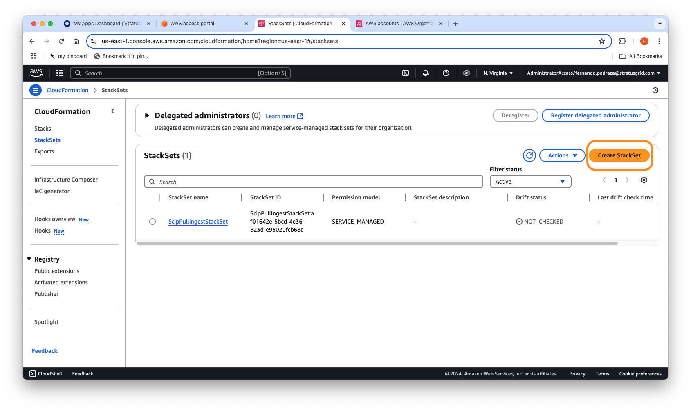

# AWS Cloudformation StackSet creation instructions:

- Navigate to the AWS Console and log in to your Management Account. Switch to the region where you want to deploy the StackSet.

- Go to the CloudFormation section of the AWS Console and select StackSets.
- Click Create StackSet.
- Select Upload a template file, click Choose file, and select either ou-sg-read-only.json or ou-sg-write-restricted.json. Click Next.
- Enter the StackSet name, for instance, StratusGrid. Click Next.
- The resource being created is an IAM role, and IAM is a global service; however, a region must be specified. Select the region where you are creating the StackSet, then click Next.
- Scroll to the bottom of the page. Check to acknowledge that IAM role resources are being created, then click Submit. The StackSet will then deploy!